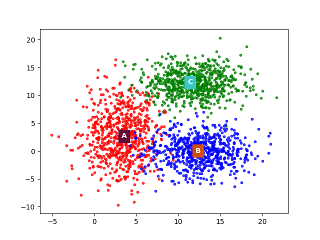
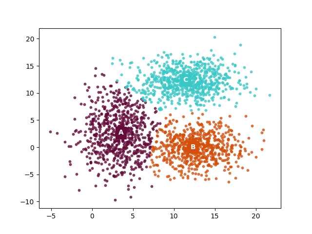

## CUDA MeanShift ##
*A CUDA implementation of MeanShift clustering algorithm. Written as Parallel Computing course project.*

Here's a pic of a generated 2D dataset, and how the points are clustered after Mean Shift:

**depandancies needed:**
* CUDA 10.0
* Boost library

MeanShift is a simple clustering algorithm. It is *embarassingly parallel*, so a natural choice for its implementation is CUDA. Currently it's only for 2D points, but since it's used for Image Segmentation, soon will be added the implementation for RGB image. 

This version is optimized to avoid lots of vram access thanks to the shared memory.

Read the included .pdf for further information.

